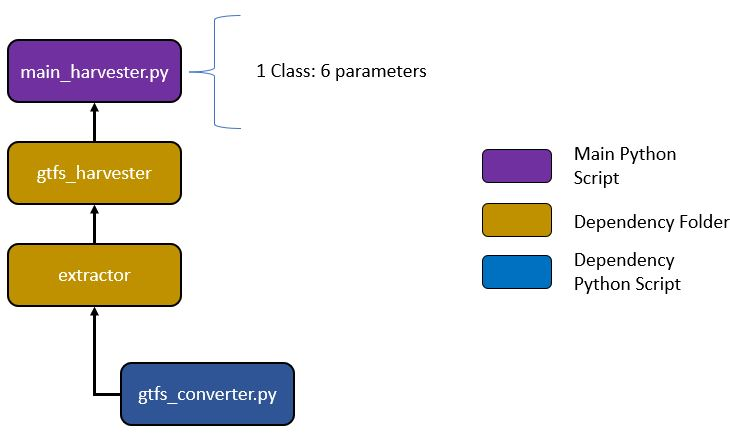
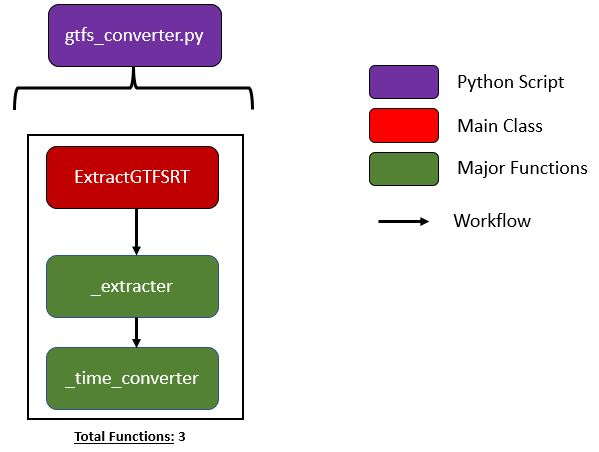

# Extensive Documentation - Data Harvester Workflow 

## Structure Overview 
The [**main_harvester.py**](../main_harvester.py) script contains 1 major process (i.e., class) that requires the user to input 6 parameters. 
 
 

## Major Process 

### A) Purpose

Iteratively harvests GTFS-RT, parses relevant entities and structures to dataframe, and appends to CSV file. 

 

### B) Function Details

Coded in [**gtfs_converter.py**](extractor/gtfs_converter.py), the **ExtractGTFSRT** class composes of 152 lines of code. 

### C) Required Parameters

| Parameter | Type | Purpose |
| :-------: | ---- | ------- |
| ***url*** | Str | The url (hyperlink) to download GTFS-RT .pb file. |
| ***city*** | Str | The name of the city you are extracting GTFS-RT from to name part of the output csv file. | 
| ***hrs_collect*** | Int | The number of hours for the harvester to run throughout the day. This is contingent to how often the GTFS-RT feed updates (e.g., Calgary every 30 sec.; Boston MBTA every 5 sec.) | 
| ***time_zone*** | Str | The time zone of the study area used in Pytz. Type [pytz.all_timezones](https://pynative.com/list-all-timezones-in-python/) to find your proper time zone. |
| ***throttle*** | Int | Pause (sleep) the harvester in x seconds. This refers to the frequency of the GTFS-RT updates. | 

### D) Step Details 
Below are the backend steps (in order) briefly explained followed by a graphic that encapsulates it. 

<ol>
	<li>Run <strong>ExtractGTFSRT</strong>
		<ul>
			<li>Receive feed message an calculate the <i>iterator</i>. The <i>iterator</i> is the amount of times the <i>for</i> loop will run based on the frequency update of the GTFS-RT feed and amount of time to collect the data per day (lines 79-87).</li> 
			<li>Parse out entities from the feed - timestamp, vehicle_id, trip_id, lat, lon - and append to a dictionary (lines 100 - 120).</li>
			<li>Construct DataFrame and append to csv (lines 123 - 140).</li>
		</ul>
	</li>
</ol>

***iterator*** = round((60 sec. / throttle) * 60 (min/hr) * hrs_collect)
 
***iterator*** = round(# of updates per hr. * hrs_collect)
 
 
For example, let's say a GTFS-RT feed from a transit agency updates every 30 seconds and you would like to collect for 12 hrs. per day. Then: 

***iterator*** = round((60 sec. / 30 sec. per update) * 60 (min./hr) * 12)
 
***iterator*** = 1,440
 
 

### E) Packages Used & Purpose 
| Package | Purpose | 
| :------: | ------ | 
| google.transit | Language bindings generated from the GTFS-RT protocol buffer. More specifically, parses out entities from the GTFS-RT feed. |
| datetime | To convert timestamp to UTC and local time. |
| requests | Acquire the hyperlink. |
| time | To throttle (i.e., sleep) the function. | 
| pytz | Working with timezones. |
| os.path | Directory management. |
| Pandas | Data Structuring & Formatting time. | 
| tqdm | Progress bar. |
