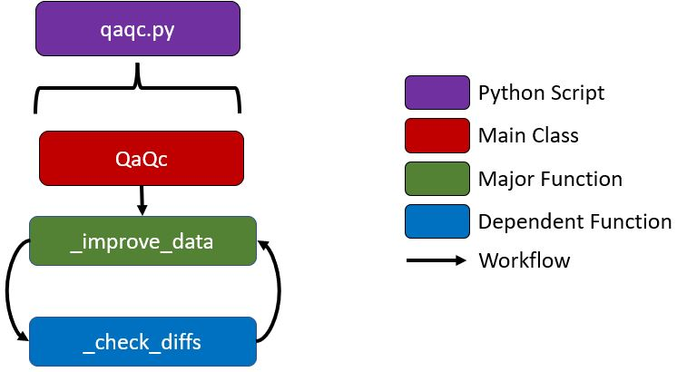

## Refine Interpolated Files 

### A) Purpose
This component of the workflow is new and essential to cleaning up in parallel unwanted observations that can skew or complicate aggregation processes downstream. These unwanted observations typcially happen at looped routes where the terminus is also the beginning of the route. The GIS snapped tool may have potentially captured the beginning part of the route whereas in reality it is at the end of the route; thus, having miscalculated interpolate results. Unfortunately, these observations cannot be updated feasibly and as a consequence they're ommited. The output is the finalized interpolated csv files per route. Naming pattern entails with "_interpolated_cleaned.csv". 

### B) Function Details 
The <strong><a href=''>prep_agg_parallel.py</a></strong> script consists of 4 data engineering functions bringing a total of 144 lines of code. Except the <strong>__init__</strong> function, all other functions are described in the table below. Terminology, such as <strong>degree order</strong> and <strong>trending order</strong> are described after the table. 

| Name of Function | Lines | Purpose | 
| :---: | ----- | ----- | 
| ***_filt_df*** | 35-48 | Filters out unwanted observations that may distort aggregate calculations.   |
| ***_clean_df*** | 51-108 | Cleaning process - removes unwanted observations including illogical observations that have very high speed and estimated extreme arrival times (> 20 min. as the threshold). |
| ***_mainprocess*** | 111-144 | The main process to clean, filter, and concat final output per interpolated csv file. This entire process is done in conventional parallel processing. | 

### C) Required Parameters (Indirect)

The user is not required to insert the parameters for the prep_agg_parallel.py script. Rather, the backend processes from transform.py inserts it programmatically as part of the downstream workflow. 

| Parameter | Type | Purpose | 
| :-------: | :---: | ------ | 
| ***start_method*** | Str | "spawn" (Windows or use of ArcPy) or "fork" (Linux without use of ArcPy) to spin up parallel processing.  | 
| ***L*** | List | Part of the Manager function in Multiprocessing, it is a list distributed across all CPU cores and stores any errors during cleaning process. After parallel processing, the errors are written in a text file as comma delimited. | 
| ***trips_txt*** | DataFrame | DataFrame of the trips.txt from the static GTFS files. | 

 
### D) Step Details 
Below are the backend steps (in order) briefly explained followed by a graphic that encapsulates it. 
<ol>
	<li>Execute <strong>self._improve_data</strong> (lines 52-97), drops unnecessary duplicate values (lines 67-73). These are trip_ids that have been recorded originally, but have not changed in the next recording. Not all GPS devices are equally synchronized.
		<ul>
			<li>Omit negative values by group by trip_id and apply <strong>self._check_diffs</strong> with defined degree order. Repeat this two more times (degree order - 2 and 1).</li>
		</ul>	
	</li>
	 
	<li>In the <strong>self._check_diffs</strong> (lines 31-49) function, assign the difference by stop sequence and index value fields and keep values that are NA or greater than or equal to zero. Drop the created fields to maintain current dataframe.
	</li>
	 
	<li>Get the retention value (lines 86-89), append retention information (lines 91), export the cleaner dataframe to csv file (lines 93-95), and return cleaner dataframe for further downstream processing (lines 97).
</ol>
 

 

### E) Packages Used & Purpose 
| Package | Purpose | 
| :-----: | ----- | 
| ***Pandas (indirect)***  | Data Engineering operations including apply, assign, query, groupby, drop_duplicates, and diff for dataframes. |
