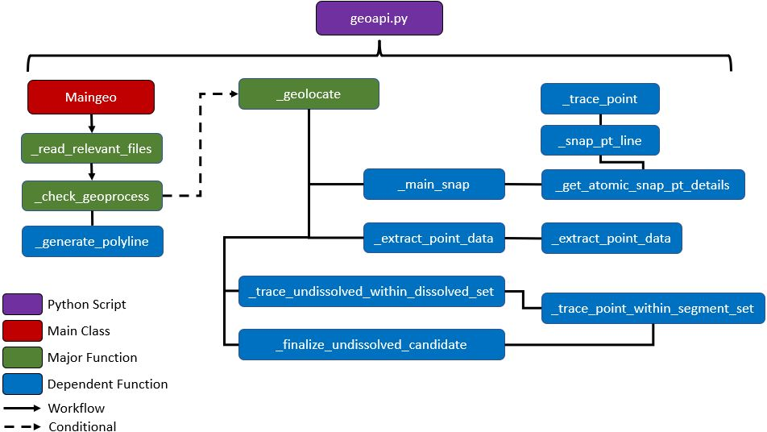

## Geoprocessing Vehicle Locations 

### A) Purpose
This component of the workflow performs the majority of the geoprocesses by identifying each vehicle's location along their transit route and returns a spatial dataframe for further data processing. 

### B) Function Details 
The <strong><a href=''>geoapi.py</a></strong> script consists of 14 spatial and data engineering functions bringing a total of 423 lines of code. Except the <strong>__init__</strong> function, all other functions are described in the table below. Keep in mind that this component of the workflow has the highest runtime due to nested apply (a less verbose way of writing <i>for</i> loops); thus, making <strong><a href='https://www.geeksforgeeks.org/analysis-algorithms-big-o-analysis/'>Big O Notation</a></strong> high. Using Calgary as a case study, there are on average over 600,000 vehicle locations recorded per day and pinpointing each on each line segment of their corresponding transit route exponentially increases the runtime. In theory, there is a faster way to reduce the Big O Notation using the <strong><a href='https://www.esri.com/en-us/arcgis/products/arcgis-python-libraries/libraries/arcpy'>ArcPy</a></strong> package instead of the <strong><a href='https://developers.arcgis.com/python/'>ArcGIS API for Python</a></strong>. However, this would require writing and reading a lot of new shapefiles and then converting the results as dataframes in memory, which altogether will slow down the runtime operation and bloat disk space. 

| Name of Function | Lines | Purpose | 
| :---: | ----- | ----- | 
| ***_read_relevant_files*** | 73-112 | Read the relevant shapefiles (developed from the static GTFS files) for each unique transit route. | 
| ***_check_geoprocess*** | 115-146 | Critical function that checks to see if the dissolved shapefile of the unique transit route exists and if so, proceed to making the ArcGIS Polyline geometry in memory. Afterwards, it checks if the paths exist for the Polyline route. If both exist, then it will proceed the rest of the processes downstream. | 
| ***_generate_polyline*** | 149-175 | Creates ArcGIS Geometry - Polyline for the dissolved transit route. | 
| ***_trace_point*** | 178-189 | Creates an ArcGIS Geometry - Point, typically from vehicle locations / snapped locations. |  
| ***_extract_point_datum*** | 192-210 | Evaluates the attributes of the Point and converts to json into a dictionary. Updates the original dataframe and normalizes the dictionary into new fields. |  
| ***_extract_point_data*** | 213-228 | Applies each row of the dataframe to the **_extract_point_datum** function. | 
| ***_snap_pt_line*** | 231-243 | Snaps each vehicle location (i.e., point) to the nearest dissolved line of their transit route. Uses the **_trace_point** function to create ArcGIS Geometry - Point. | 
| ***_get_atomic_snap_pt_details*** | 246-269 | Receives the snap point details from **_snap_pt_line** function for every associated combination of trip_id and lat and lon coordinates. |  
| ***_main_snap*** | 272-289 | A main function that snaps each point to the nearest line of the transit route and consolidates the list of snap point details into a single dataframe. Uses **_get_atomic_snap_pt_details** function. |  
| ***_trace_point_within_segment_set*** | 292-308 | Checks if the snapped point fits/is within a (un)dissolved line, returns only the successful match. |  
| ***_trace_undissolved_within_dissolved_set*** | 311-345 | A main function that identifies where the vehicles are on their transit route via dissolved segments (generic). From there, come up with a list of undissolveed segment based on the identified stop_sequence value. Uses **_trace_point_within_segment_set** function. |
| ***_finalize_undissolved_candidate*** | 348-360 | A main function that goes through every undissolved segment candidate that corresponds to the grouped trip_id and barcode. Captures which undissolved segment is the snapped point of the vehicle is truly within. Uses **_trace_point_within_segment_set** function. | 
| ***_geolocate*** | 363-423 | The **main operation** that identifies where each vehicle is exaclty located along the transit route. Uses the **main_snap** function to snap vehicle locations to the nearest line, **_trace_undissolved_within_dissolved_set** to list undissolved candidates by identifying which dissolved segment each snapped point is within, and **_finalize_undissolved_candidate** to identify which undissolved segment candidate is the snapped point within. | 

### C) Required Parameters (Indirect)

The user is not required to insert the parameters for the geoapi.py script. Rather, the backend processes from transform.py inserts it programmatically as part of the downstream workflow. 

| Parameter | Type | Purpose | 
| :-------: | :---: | ------ | 
| ***folder_date*** | Str | The date that belongs to the static GTFS update across the project directory used to process the raw GTFS-RT. An example is "2021-09-30" from "../data/0_external/2021-09-30". |
| ***indiv_rte*** | DataFrame | DataFrame from the collected raw GTFS-RT dataset merged with file explorer (directory and name of static GTFS shapefiles per individual route) executed by discover_docs. | 
| ***wkid*** | Int | The spatial reference number to project ArcGIS Geometry - Points and Polylines (e.g., 4326; 3857). | 
| ***unique_val*** | Str | The unique transit route currently being processed (e.g., "4-40066-Outbound"). |
| ***L*** | List | Part of the Manager function in Multiprocessing, it is a list distributed across all CPU cores and stores any applicable error message. After parallel processing, the error messages are written in an error.log file for the user to inspect. | 
 

### D) Step Details 
Below are the backend steps (in order) briefly explained followed by a graphic that encapsulates it. 
<ol>
	<li>Execute <strong>self._read_relevant_files</strong> (lines 44-46), reads undissolved & dissolved transit routes and transit stop shapefiles matching the individual transit route (i.e., unique_val) (lines 73-112).</li>
	 
	<li>Execute <strong>self._check_geoprocess</strong> (lines 49-53), checks if the necessary files and geometry paths exist, if so - return as a tuple hosting two values (ArcGIS Geometry - Polyline; binary number - [0 = not found & do not proceeed; 1 = found & proceed]).
		<ul>
			<li>If the appropriate transit files exist (lines 131-136) - proceed to creating an ArcGIS Geometry - Polyline via <strong>self._generate_polyline</strong> (lines 149-175).</li>
			<li>If both - appropriate transit files exist and the Polyline geometry of the transit route exists (lines 138-143), return the ArcGIS Polyline geometry and 1; otherwise return the tuple as 0.</li> 
		</ul>
	</li>
	 
	<li>Execute <strong>self._geolocate</strong> (lines 60 - 70) if the 2nd value of the tuple is 1; otherwise return as None, which would not proceed downstream. The function executed does most of the spatial operations (lines 363-423) along with data engineering processes by: 
		<ul> 
			<li>From the dissolved transit route file (<strong>diss_file</strong>), set up individual Polyline dissolved segments with their corresponding stop sequence value and store it as a tuple (lines 384).</li>
			<li>From the raw GTFS-RT (<strong>indiv_rte</strong>) group by trip_id field and iteratively snap each vehicle location (<strong>self._main_snap</strong>) to the nearest line on the transit route (lines 391-392).</li>
			<li>Extract point data (<strong>self._extract_point_data</strong>) (lines 393).</li>
			<li>Group by trip_id field (lines 396) and iteratively take each snapped point to iteratively identify which dissolved segment it is within (<strong>self._trace_undissolved_within_dissolved_set</strong>). From the dissolved segment, acquire a list of undissolved segment candidates through the stop sequence being queried (lines 397-399).</li>
			<li>Group by barcode and trip_id fields and identify which undissolved segment (<strong>self._finalize_undissolved_candidate</strong>) from the candidate list does the snapped point fall within (lines 400-402).</li>
			<li>Query only identified undissolved segments (i.e., index_val) and drop the column index_val (lines 406-410).</li>
			<li>Return the output as a spatial dataframe (lines 415) containing the following fields: stop_id, stop_sequence, index, objectid, SHAPE, barcode, Local_Time, trip_id, point, x, y, and wkid. Refer to <strong>section E</strong> for more details on the field and sample output.</li>
			<li>Raise exception if there is a data integrity issue during the process, particularly if the index_val field does not exist, and append it to the list for error logging (lines 417-419).</li>
			<li>Raise exception if there is a failure during spatial operation (e.g., topological errors) (lines 421-423).</li>
		</ul>
	</li>
</ol>
 

 

### E) Spatial DataFrame Output
| Field | Description | 
| :---: | ----------- | 
| ***stop_id*** | Identifier of the transit stop of the transit route provided by the static GTFS files. | 
| ***stop_seque*** | Tied to stop_id, the sequence number of the transit stop of the transit route. | 
| ***index*** | The index value of the undissolved segment identified provided by the undissolved shapefile - static GTFS files. | 
| ***objectid*** | Related to the index value of the undissolved segment - typically 1 value above it. | 
| ***SHAPE*** | The shape of the undissolved segment as ArcGIS Geometry - Polyline. | 
| ***barcode*** | An index to track certain components of the data, particularly trip_id. | 
| ***Local_Time*** | From the GTFS-RT, the timestamp of the vehicle location recorded. |
| ***trip_id*** | From the GTFS-RT, the transit route identifier of the vehicle. |
| ***point*** | The shape (as a string to avoid conflict with SHAPE) of the vehicle's snapped point position. |
| ***x*** | The x-coordinate (longitude) of the snapped point. |
| ***y*** | The y-coordinate (latitude) of the snapped point. |
| ***wkid*** | The spatial reference of the snapped point. |  

| stop_id | stop_seque | index | objectid | SHAPE | barcode | Local_Time | trip_id | point | x | y | wkid | 
| ------- | ---------- | ----- | -------- | ----- | ------- | ---------- | ------- | ----- | --- | --- | --- | 
| 9245 | 3 | 38 | 39 | {'paths': [[[-114.07547299999999, 50.92544700000008], [-114.07571299999995, 50.92577300000005]]], 'spatialReference': {'wkid': 4326, 'latestWkid': 4326}} | 1 | 9/30/2021 6:30:56 AM | 57429050 | {'x': -114.07569517273546, 'y': 50.925748784364636, 'spatialReference': {'wkid': 4326, 'latestWkid': 4326}} | -114.0756952 | 50.92574878 | 4326 | 
| 9245 | 3 | 78 | 79 | {'paths': [[[-114.07176199999998, 50.92629800000003], [-114.07084799999996, 50.926067000000046]]], 'spatialReference': {'wkid': 4326, 'latestWkid': 4326}} | 2 | 9/30/2021 6:31:31 AM | 57429050 | {'x': -114.07124115092947, 'y': 50.92616636262595, 'spatialReference': {'wkid': 4326, 'latestWkid': 4326}} | -114.0712412 | 50.92616636 | 4326 | 
| 7253 | 4 | 123 | 124 | {'paths': [[[-114.06950499999999, 50.92133300000006], [-114.06935099999998, 50.92097800000005]]], 'spatialReference': {'wkid': 4326, 'latestWkid': 4326}} | 3 | 9/30/2021 6:32:16 AM | 57429050 | {'x': -114.06938733945167, 'y': 50.921061769922915, 'spatialReference': {'wkid': 4326, 'latestWkid': 4326}} | -114.0693873 | 50.92106177 | 4326 | 
| 7254 | 5 | 126 | 127 | {'paths': [[[-114.06933999999995, 50.92095200000006], [-114.06891099999996, 50.91991200000007]]], 'spatialReference': {'wkid': 4326, 'latestWkid': 4326}} | 4 | 9/30/2021 6:32:46 AM | 57429050 | {'x': -114.0689143808438, 'y': 50.919920195680625, 'spatialReference': {'wkid': 4326, 'latestWkid': 4326}} | -114.0689144 | 50.9199202 | 4326 | 
| ... | ... | ... | ... | ... | ... |... | ... | ... |... | ... | ... |
| 9187 | 54 | 1052 | 1053 | {'paths': [[[-114.09416699999997, 50.92128700000006], [-114.09270399999997, 50.92128700000006]]], 'spatialReference': {'wkid': 4326, 'latestWkid': 4326}} | 97 | 9/30/2021 7:19:31 AM | 57429050 | {'x': -114.09408569335936, 'y': 50.92128699959539, 'spatialReference': {'wkid': 4326, 'latestWkid': 4326}} | -114.0940857 | 50.921287 | 4326 |
| 4796 | 19 | 389 | 390 | {'paths': [[[-114.06682599999999, 50.907073000000025], [-114.066893, 50.90719500000006]]], 'spatialReference': {'wkid': 4326, 'latestWkid': 4326}} | 1 | 9/30/2021 6:00:16 AM | 57429052 | {'x': -114.06682912475746, 'y': 50.9070786892299, 'spatialReference': {'wkid': 4326, 'latestWkid': 4326}} | -114.0668291 | 50.90707869 | 4326 | 

### F) Packages Used & Purpose 
| Package | Purpose | 
| :-----: | ----- | 
| ***ArcGIS API for Python***  | Creating Polyline and Point geometries, readings dissolved and undissolved transit lines and transit stops as spatial dataframes, snapping points to the nearest line, and finding lines from points that are within. |   
| ***Pandas***  | Data Engineering operations including apply, query, groupby, json_normalize, series, and concat for dataframes. |
| ***tqdm***    | Progress bar. |
| ***os***      | Detect OS Errors. | 
