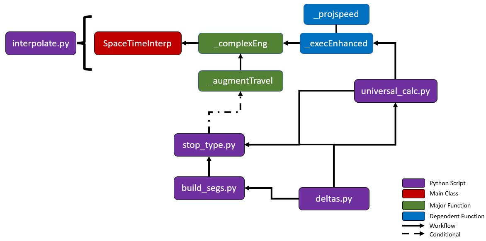
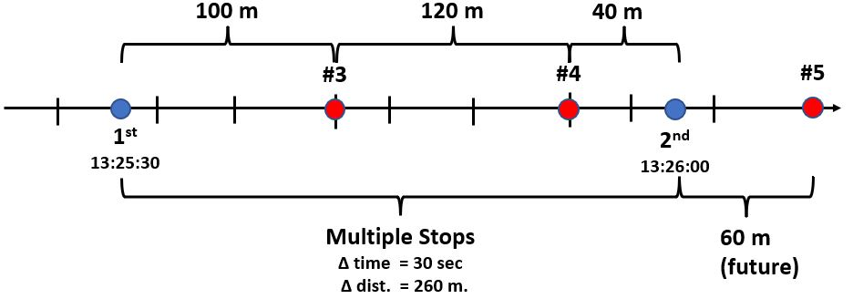
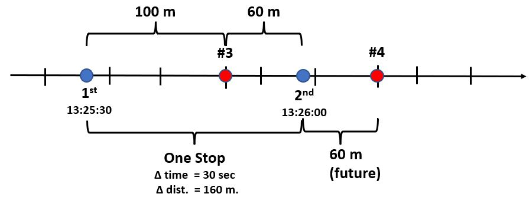
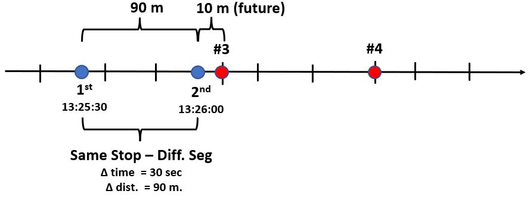
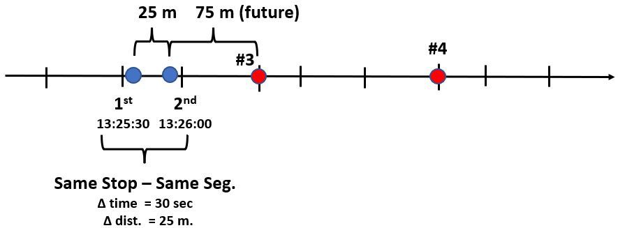
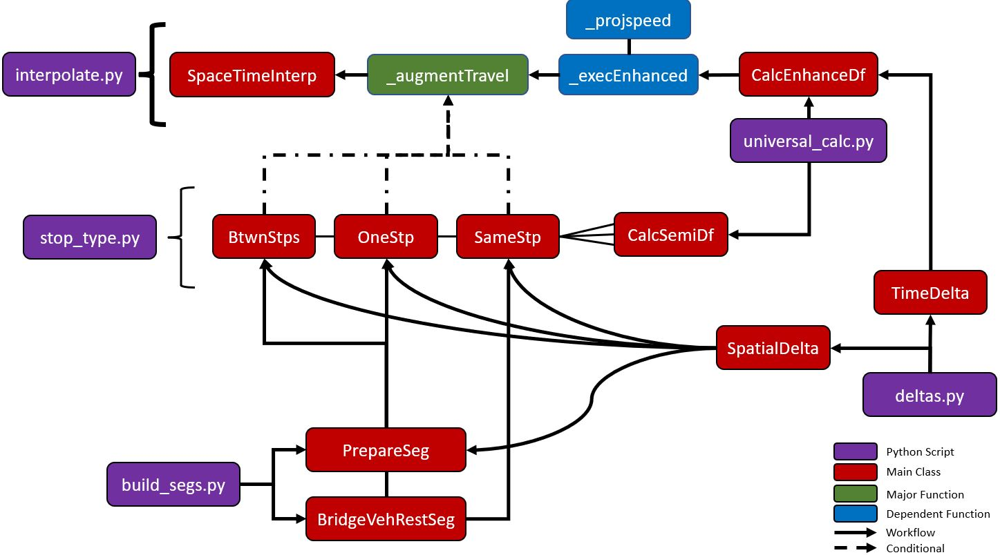
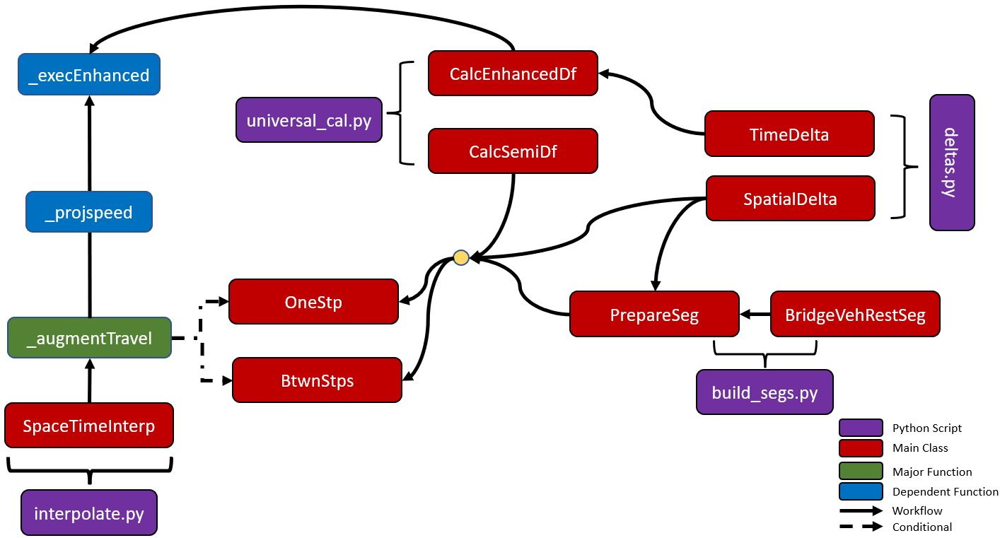
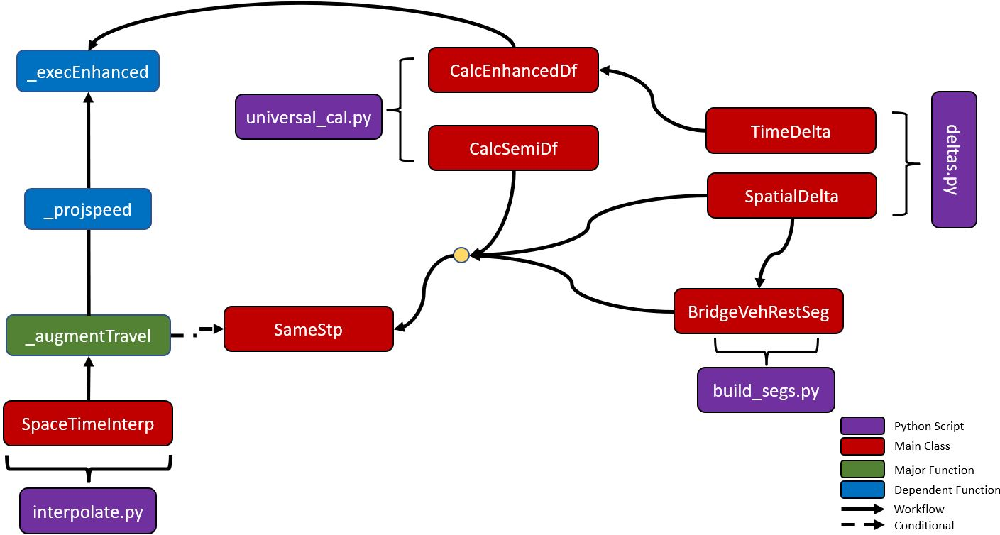

## Spatiotemporal Interpolation 

### A) Purpose
This component of the workflow interpolates on-time performance per stop from each consecutive pair of the transit vehicle's locations (per grouped trip_id and later include idx). The dataframe is augmented with more features and observations (e.g., stops not recorded and have happened in between) that have not been calculated / factored in before. These detailed characteristics are a precursor to aggregate on-time performance per stop per hour per route. 

### B) Function Details 
The <strong><a href='interpolate.py'>interpolate.py</a></strong> script consists of 5 data engineering functions bringing a total of ~500 lines of code. **Please Note** that this does not factor additional under-the-hood code. In other words, this module depends on 4 other custom Python scripts to perform spatiotemporal operations robustly and properly; thus, making it the most complex operation with approximately of 1650 lines of code. With this much code followed by nested apply functions, it has the 2nd highest Big O Notation after the **geoapi.py.** From its complexity, it is imperative to pay close attention to several concepts that are explained in Section C to reduce confusion. 

Except the <strong>__init__</strong> function, all other functions are described in the table below. 

| Name of Function | Lines | Purpose | 
| :---: | ----- | ----- | 
| ***_projspeed*** | 86-97 | Calculates projected travel speed (delta distance / delta time). Delta distance is the distance travelled between the consecutive pair (1st veh. recorded and 2nd veh. recorded of the same trip id.)  |
| ***_execEnhanced*** | 100-168 | Imports the data augmentation class - **CalcEnhanceDf** from the **universal_calc.py** script. Final data augmentation process by stitching all missing travel information together and add additional features to return extensive schema. |
|***_augmentTravel*** | 171-423 | The "brains" of the entire component that inspects the consecutive pair and determines the type of travel that happened (Section C), initiates data augmentation from **stop_type.py**, **build_segs.py**, **deltas.py**, and **universal_calc.py** (via **CalcSemiDf**) to create a new schema, and feeds that in the final data augmentation process. |
|***_complexEng*** | 426-491 | Initiates the entire process and performs complex data engineering operations in Pandas and the ArcGIS API for Python. After the operation, it will extract and concat dataframes from the dataframe itself, export to csv file placed in the **5_conformed/{gtfs-update}** folder, and calculates error rate. The error rate computes of how much data (%) has been lost per route during interpolation process due to data integrity or spatial operation issue. |

Below is an image that encapsulates a generic overview of the backend processes.
 
 

 

### C) Interpolation Concepts 

There are five main types of consecutive movements identified in **_augmentTravel** function that are then processed in **build_segs.py** and **universal_calc.py**:
<ol>
	<li><strong>Movement through Multiple (in-between) Stops:</strong> Defined as the first of the two recordings (in blue) of the same vehicle in the consecutive pair en-transit (i.e., movement), where the 2nd recording has travelled through several (>= 2) stops (in red) from its 1st recording.</li>
	 
	

	 
	<li><strong>Movement through One Stop:</strong> Similar as the multiple stops scenario, except the 2nd recording has travelled through one stop from its 1st recording.</li>
	 
	

	 
	<li><strong>Movement at Same Stop at Different Segment:</strong> Both recordings are en-transit to the same stop, except the 2nd recording is on a different segment.</li>
	 
	

	 
	<li><strong>Movement at Same Stop at Same Segment:</strong> Both recordings are en-transit to the same stop, except the 2nd recording is on the same segment (at a distance) from the 1st.</li>
	 
	

	 
	<li><strong>Stationary:</strong> The 1st recording that has been classified as stationary from the prior enriched processed. Does not factor the 2nd recording.</li>
</ol>
 

### D) Sample Calculations From Interpolations

There are multiple features important to calculate on-time performance and identify spatiotemporal changes using the illustrations above as examples. For each example, these calculations will be based on the following:  

<table> 
	<tr>
		<td><strong>Travel Type</strong></td>
		<td><strong>Travel Desc.</strong></td>
	</tr>
	<tr>
		<td><strong>Multiple Stops</strong></td>
		<td>1st veh -> #3 stop   #3 stop -> #4 stop   #4 stop -> 2nd veh   2nd veh -> #5 stop (future)</td>
	</tr> 
	<tr>
		<td><strong>One Stop</strong></td>
		<td>1st veh -> #3 stop   #3 stop -> 2nd veh   2nd veh -> #4 stop (future)</td>
	</tr>
	<tr>
		<td><strong>Same Stop - Diff. Seg.</strong></td>
		<td>1st veh -> (same stop - diff. seg)   (same stop - diff. seg) -> 2nd veh   1st veh & 2nd veh -> #3 stop (future)</td>
	</tr>
	<tr>
		<td><strong>Same Stop - Same Seg</strong></td>
		<td>1st veh -> 2nd veh.   1st veh & 2nd veh -> #3 stop (future)</td>
	</tr>
</table>
 
 
<table> 
	<tr>
		<td><strong>Field</strong></td>
		<td><strong>Purpose</strong></td>
		<td><strong>Multiple Stops</strong></td>
		<td><strong>One Stop</strong></td>
		<td><strong>Same Stop - Diff. Seg</strong></td>
		<td><strong>Same Stop - Same Seg.</strong></td>
	</tr>
	<tr>
		<td><strong>dist</strong></td>
		<td>
Contingent on the type  of consecutive movement,  calculates the distance (meters)  travelled from the 1st veh  to its 
		stop sequence,  stop sequence to nth stop sequence, and nth stop sequence to the 2nd veh.
</td>
		<td>100m 120m  40m</td>
		<td>100m 60m</td>
		<td>90m</td>
		<td>25m</td>
	</tr>
	<tr>
		<td><strong>Tot_Dist</strong></td>
		<td>
Total distance travelled (cumulative of dist).
</td>
		<td>260m</td>
		<td>160m</td>
		<td>90m</td>
		<td>25m</td>
	</tr>
	<tr>
		<td><strong>Delta Time</strong></td>
		<td>
Not included in the final schema, however it calculates the time elapsed between the 1st and 2nd recording pair.   <strong>Formula:</strong> 2nd Time - 1st Time
</td>
		<td>30 sec.</td>
		<td>30 sec.</td>
		<td>30 sec.</td>
		<td>30 sec.</td>
	</tr>
	<tr>
		<td><strong>proj_speed</strong></td>
		<td>
Projected travel speed (km/hr.) from delta time and delta distance (Tot_Dist) between the consecutive pair.   <strong>Formula:</strong> (delta dist / delta time)*3.6

		<td>31.2 km/hr</td>
		<td>17.1 km/hr</td>
		<td>10.8 km/hr</td>
		<td>3.0 km/hr</td>
	</tr>
	<tr>
		<td><strong>proj_trvel</strong></td>
		<td>
Projected travel time (sec.) to reach destination from projected speed and distance needed to cover. We are also factoring <strong>future distance</strong>, which is usually from the 2nd veh. to the next stop sequence. For multiple stops it is to the #5 stop sequence, which is 80 meters away from the 2nd veh. For one stop, it is the #4 that is 60 meters away from the 2nd veh. In both same stop scenarios, we are factoring both 1st and 2nd veh. to factor any calculus in speed, travel time, and on-time performance on the next consecutive pair set.  <strong>Formula:</strong> ((dist/1000) / proj_speed)*3600
</td>
		<td>11.5 s. 13.9 s. 4.6 s.</td>
		<td>21.0 s. 12.5 s.</td>
		<td>30.0 s.</td>
		<td>30.0 s.</td>
	</tr>
	<tr>
		<td><strong>dist_futr</strong></td>
		<td>
The future distance (meters) left to reach the next destination. For <strong>multiple stops</strong> and <strong>one stop</strong>, future distance would incorporate from the 2nd veh to the next stop destination, whereas <strong>same stop - same seg. or diff. seg.</strong> factors 1st to the next stop and 2nd veh to the next stop.
</td>
		<td>60m</td>
		<td>60m</td>
		<td>100m    10m</td>
		<td>100m    75m</td>
	</tr>
	<tr>
		<td><strong>futr_trvel</strong></td>
		<td>
The future travel time (seconds) to cover the future distance.
</td>
		<td>6.9 s.</td>
		<td>12.5 s.</td>
		<td>33.3 s. (1st veh)  3.3 s. (2nd veh)</td>
		<td>120.0 s. (1st veh)  90 s. (2nd veh)</td>
	</tr>
	<tr>
		<td><strong>curr_time</strong></td>
		<td>The recorded timestamp from the 1st veh and 2nd veh. in the consecutive group.</td>
		<td>13:25:30 13:26:00</td>
		<td>13:25:30 13:26:00</td>
		<td>13:25:30 13:26:00</td>
		<td>13:25:30 13:26:00</td>
	</tr>
	<tr>
		<td><strong>off_earr</strong></td>
		<td>Official estimated arrival time to their respective destination added from <strong>proj_trvel</strong> and/or <strong>futr_trvel</strong>.</td>
		<td>13:25:42 (#3)  13:25:56 (#4)  13:26:00 (2nd veh)  13:26:07 (2nd veh -> #5)</td>
		<td>13:25:50 (#3)  13:26:00 (2nd veh)  13:26:13 (2nd veh -> #4)</td>
		<td>13:26:00 (2nd veh)  13:26:04 (1st veh -> #3)  13:26:04 (2nd veh -> #3)</td>
		<td>13:26:00 (2nd veh)  13:27:30 (1st veh -> #3)  13:27:30 (2nd veh -> #3)</td>
	</tr>
	<tr>
		<td><strong>sched_arr</strong></td>
		<td>The expected schedule arrival time per transit stop.</td>
		<td>13:25:45 (#3)  13:26:15 (#4)  13:26:45 (#5)</td>
		<td>13:25:45 (#3)  13:26:15 (#4)</td>
		<td>13:25:45 (#3)</td>
		<td>13:25:45 (#3)</td>
	</tr>
	<tr>
		<td><strong>off_arrdif</strong></td>
		<td>The official estimated time difference (seconds) calculated from the estimated arrival time (<strong>off_earr</strong>) and scheduled arrival time (<strong>sched_arr</strong>). Includes future estimated arrival time difference.</td>
		<td>3 s. (#3)  19 s. (#4)  38 s. (#5)   </td>
		<td>-5 s. (#3)  2 s. (#4)</td>
		<td>-19 s. (1st veh - #3)  -19 s. (2nd veh - #3)</td>
		<td>-120 s. (1st veh - #3)  -90 s. (2nd veh - #3)</td>
	<tr>
		<td><strong>perf_chge</strong></td>
		<td>The percent change in official time difference (<strong>off_arrdif</strong>) consecutively. It estimates how much of a change there has been in travel over time. Higher (positive/negative) values may indicate abrupt changes in travel due to traffic incident, surge in passenger boardings/alightings, traffic congestion, or speeding up to catch up with their next transit stops. The formula is: ((next value of off_arrdif - off_arrdif)/(off_arrdif))*100. Applies only to <strong>multiple stops</strong>, <strong>one stop</strong>, and <strong> same stop - same seg.</strong> travel type.</td>
		<td>N/A  533% (#4-#3)  100% (#5-#4)</td>
		<td>N/A  -140% (#4-#3)</td>
		<td>N/A  0% (1st to #3 - 2nd veh to #3)</td>
		<td>N/A  -25% (1st to #3 - 2nd veh to #3)</td>
	</tr>
	<tr>
		<td><strong>perf_rate</strong></td>
		<td>Classification of on-time performance: Late (<= -120 sec.); On-Time (120 sec. < x < 300 sec.); Early (>= 300 sec.)</td>
		<td>On-Time   On-Time   On-Time</td>
		<td>On-Time   On-Time </td>
		<td>On-Time   On-Time </td>
		<td>Late    On-Time </td>	
	</tr>
</table>
 

### E) Required Parameters (Indirect)

The user is not required to insert the parameters for the qaqc.py script. Rather, the backend processes from transform.py inserts it programmatically as part of the downstream workflow. 

| Parameter | Type | Purpose | 
| :-------: | :---: | ------ | 
| ***enrich_df*** | DataFrame | The enriched dataframe from an upstream process with the following schema: trip_id, idx, barcode, Status, stat_shift, stop_id, stop_seque, MaxStpSeq, true_max_stp, Stp_Left, Stp_Diff, objectid, index, MaxIndex, Idx_Left, Idx_Diff, x, y, wkid, point, pnt_shift, Local_Time, time_shift, delta_time, arrival_time, departure_time, delta_dist, and SHAPE. |
| ***undiss_df*** | DataFrame | The spatial dataframe (in-memory) of the undissolved segments for the transit route. |
| ***stop_times*** | DataFrame | DataFrame of the scheduled information (from one of the static GTFS files) per stop_id (transit stop) per trip_id (vehicle's id associated to transit route). |
| ***wkid*** | Int | Spatial reference to project polylines. | 
| ***folder_date*** | Str | The date that belongs to the static GTFS update across the project directory used to process the raw GTFS-RT. An example is "2021-09-30" from "../data/0_external/2021-09-30". |
| ***raw_date*** | Str | The date of the raw GTFS-RT. | 
| ***unique_val*** | Str | The unique transit route currently being processed (e.g., "4-40066-Outbound"). |
| ***L4*** | List | The list that is part of the Manager in Multiprocessing - report error/loss rate & error type (if applicable). | 

 
 
### F) Step Details 
Below are the backend steps (in order) briefly explained followed by a figure that encapsulates it.
<ol>
	<li>Execute <strong>self._complexEng</strong> (lines 426-491), group by <strong>trip_id</strong> and perform data engineering operations in Pandas including using the apply function to run<strong>self._augmentTravel</strong>.</li>
	 
	<li>In the <strong>self._augmentTravel</strong> (lines 171-423), conditionally identify the travel type in each observation. Nearly all conditional statements use the <strong>self._projSpeed</strong> and <strong>self._execEnhanced</strong> functions and have their own class in the <strong>stop_type.py</strong>. Due to the backend complexity of the encapsulated figure, <strong>Section G</strong> breaks it down per stop type (BtwnStps, OneStp, SameStp) and includes several workflow figures.
		<ul>
			 
			<li>If the travel type status is<strong>Movement</strong> or <strong>Terminus</strong>:
				<ul>
					 
					<li>If the stop sequence of the two vehicles are not the same and have a difference less than -1, then implement the <strong>BtwnStps</strong> class. This refers to the <strong>Movement through Multiple (in-between) Stops</strong>.</li>
					 
					<li>If the stop sequence of the two vehicles are not the same and have a difference of -1, then implement the <strong>OneStp</strong> class. This refers to the <strong>Movement through One Stop</strong>.</li>
					 
					<li>If the stop sequence of the two vehicles are the same:
						<ul>
							 
							<li>If the index values (undissolved segments) of the two vehicles are the same, then implement the <strong>SameStp</strong> class with a connection type note as <strong> Same Stop - Same Segment</strong>.</li>
							 
							<li>If the index values (undissolved segments) of the two vehicles are different, then implment the <strong>SameStp</strong> class with a connection type note as <strong> Same Stop - Different Segment</strong>.</li>
						</ul>
					</li> 
				</ul>
			</li>
			 
			<li>Else if the travel type status is <strong>Stationary</strong>, then most of the input variables are set to <strong>None</strong> or <strong>0</strong>.</li> 
			 
			<li>Else if the travel type status is <strong>Terminus</strong> with a second status identified as <strong>None</strong>, then return <strong>None</strong>.</li>
		</ul>
	</li> 
</ol>
 
	

 

### G) Specific Backend Processes - Conditional by Travel Type

In the <strong>self._augmentTravel</strong> function, the workflow are in the following ordered steps: 
	<ol>
		<li>Conditional by travel type whether if it will executed in the <strong>BtwnStps, OneStp, or SameStp</strong> class unless it is <strong>Stationary</strong> or <strong>Terminus</strong> with a second travel status set to <strong>None</strong>.</li>
		 
		<li>After the travel type category has been identified and executed, the <strong>self._projspeed</strong> is used to calculate the projected travel speed (delta distance / delta time).</li>
		 
		<li>Finally, enhance/augment the existing dataframe by calculating and adding the following fields described in <strong>Section D</strong>.</li>
	</ol>

 

The workflow below applies only to travel types that are either <strong>Movement through Multiple (in-between) Stops</strong> (i.e., BtwnStps) or <strong>Movement through One Stop</strong> (i.e., OneStp).

 

 
 

The workflow below applies only to the travel type <strong>Movement through Multiple (in-between) Stops</strong> (i.e., SameStp) whether the two vehicles are on the same or at different segments.

 

 
More information of the classes that have not been explained can be viewed either in the class dictionary or in the provided Python scripts.
 

### H) Spatial DataFrame Output 
| Field | Category | Description | 
| :---: | ---------| ----------- | 
| ***trip_id*** | ID | From the GTFS-RT, the transit route identifier of the vehicle. | 
| ***idx*** | Grouped Movement | Cumulate the number of vehicle movements (aka - recordings; not original after QA/QC) per trip_id. ***For future aggregations use this to groupby followed by trip_id***. | 
| ***stop_id*** | Stop | Identifier of the transit stop of the transit route provided by the static GTFS files. |
| ***stop_seque*** | Stop | Tied to stop_id, the sequence number of the transit stop of the transit route. |
| ***status*** | Movement | Pre-determine the vehicle's mobility status of the vehicle (will require distance as well). |
| ***proj_speed*** | Interpolation | Projected travel speed (delta distance / delta time) expressed in km/hr. |  
| ***x*** | Point | The x-coordinate (longitude) of the snapped point. | 
| ***y*** | Point | The y-coordinate (latitude) of the snapped point. |
| ***Tot_Dist*** | Interpolation | Total distance (meters) covered from the first vehicle to the second vehicle consecutively via grouped ***idx***. | 
| ***dist*** | Interpolation | The distance (meters) traveled per observation to reach the stop includes non-recorded (i.e., stop to stop). | 
| ***dist_futr*** | Interpolation | The distance (meters) that will need to be traveled from the observation to the next stop (i.e., future distance). Usually it is from the 2nd vehicle except if the travel type is same stop - same segment or same stop - different segment, then it will include 1st vehicle as well. | 
| ***futr_trvel*** | Interpolation | The travel time (seconds) estimated to arrive to its future destination based on future distance and projected speed. | 
| ***proj_trvel*** | Interpolation | The travel time (seconds) estimated to arrive to its destination based on distance and projected speed. | 
| ***curr_time*** | Time | The recorded timestamp from the vehicle via GTFS-RT. | 
| ***est_arr*** | Time | The estimated arrival time based on ***proj_trvel*** and ***curr_time*** - cumulative except the last observation in the grouped ***idx***. | 
| ***off_earr*** | Time | The official estimated arrival time for all observations including the last observation per grouped ***idx***. | 
| ***curr_time*** | Time | From the GTFS-RT, the timestamp of the vehicle location recorded. |
| ***tmp_arr*** | Time | The scheduled/expected arrival time reformatted (YYYY-mm-dd HH:MM:SS) includes the last observation per grouped ***idx***. |
| ***sched_arr*** | Time | The official scheduled/expected arrival time reformatted (YYYY-mm-dd HH:MM:SS) includes the last observation per grouped ***idx***. |
| ***arr_tmedif*** | Metric | Arrival time difference (sec.) calculated from estimated arrival time and scheduled/expected arrival time - excludes last observation per grouped ***idx***. | 
| ***off_arrdif*** | Metric | Official time difference (sec.) calculated from estimated arrival time and scheduled/expected arrival time - includes last observation per grouped ***idx***. |
| ***perc_chge*** | Metric | Percent change in official time difference - estimates how much of a change there has been in travel over space and time. | 
| ***perf_rate*** | Metric | Classification of on-time performance from ***off_arrdif***. Late = (<= -120 sec.); On-Time (120 < x < 300); Early (>= 300). | 
| ***dept_time*** | Time | The scheduled/expected departure time from the stop (not reformatted). | 
| ***end_path*** | Spatial | The linestring paths (nested coordinates) of each observation per grouped ***idx***, except last one. The last one is drawn backwards. This can be drawn out spatially if required. | 

  
  

| trip_id | idx | stop_id | stop_seque | status | proj_speed | x | y | Tot_Dist | dist | dist_futr | futr_trvel | proj_trvel | curr_time | est_arr | off_earr | tmp_arr | sched_arr | arr_tmedif | off_arrdif | perc_chge | perf_rate | dept_time | end_path |
| :-----: | --- | ------- | ---------- | ------ | ---------- | --- | --- | ----- | ----- | ------- | ---------- | ---------- | --------- | ------- | -------- | ------- | --------- | ----- | ----- | ------ | ------ | ------ | ----- | 
| 57436553 | 1 | 5042 | 2 | Movement | 19.2 | -114.1138535 | 51.052491 | 319.37 | 98.69 | N/A | N/A | 19 | 9/30/2021 15:42:42 | 9/30/2021 15:43:01 | 9/30/2021 15:43:01 | 9/30/2021 15:44:00 | 9/30/2021 15:44:00 | 59 | 59 | N/A | On-Time | 15:44:00 | [[-114.11385350485796, 51.05249100413442], [-114.11293099999995, 51.05249200000003], [-114.11293099999995, 51.05249200000003], [-114.11244599999998, 51.05249300000003]] |
| 57436553 | 1 | 8019 |	3 | Movement | 19.2 | -114.1092988 | 51.05249544 | 319.37 |	220.68 | 130.4 | 24 | 41 | 9/30/2021 15:43:42 | N/A | 9/30/2021 15:44:06 | N/A | 9/30/2021 15:46:00 | N/A |	114 | 93.22 | On-Time | 15:46:00 | [[-114.11244599999998, 51.05249300000003], [-114.11048199999999, 51.05249400000008], [-114.11048199999999, 51.05249400000008], [-114.1092987589738, 51.05249544381581]] |
| 57436553 | 2 | 8019 |	3 |	Movement | 29.1 | -114.1092988 | 51.05249544 | 371.8 | 130.4 | N/A | N/A | 16 | 9/30/2021 15:43:42 | 9/30/2021 15:43:58 | 9/30/2021 15:43:58 | 9/30/2021 15:46:00 | 9/30/2021 15:46:00 | 122 | 122 | N/A | On-Time | 15:46:00 | [[-114.1092987589738, 51.05249544381581], [-114.10802399999994, 51.05249700000007], [-114.10802399999994, 51.05249700000007], [-114.10743899999994, 51.05249700000007]] | 
| 57436553 | 2 | 7370 | 4 | Movement | 29.1 | -114.1039963 | 51.052501 | 371.8 | 241.4 | 103.23 | 13 | 30 | 9/30/2021 15:44:28 | N/A | 9/30/2021 15:44:41 | N/A | 9/30/2021 15:48:00 | N/A | 199 | 63.11 | On-Time | 15:48:00 | [[-114.10743899999994, 51.05249700000007], [-114.10625199999998, 51.05249900000007], [-114.10556099999997, 51.05249900000007], [-114.10476699999998, 51.052500000000066], [-114.10426599999994, 51.05250200000006], [-114.10399799999999, 51.05250100000006], [-114.10399799999999, 51.05250100000006], [-114.10399627685548, 51.05250099992128]] |
| 57436553 | 3 | 7370 |	4 | Movement | 38.5 | -114.1039963 | 51.052501 | 149.78 | 103.23 | N/A | N/A | 10 | 9/30/2021 15:44:28 | 9/30/2021 15:44:38 |	9/30/2021 15:44:38 | 9/30/2021 15:48:00 | 9/30/2021 15:48:00 | 202 | 202 | N/A | On-Time | 15:48:00 | [[-114.10399627685548, 51.05250099992128], [-114.103096, 51.05250100000006], [-114.103096, 51.05250100000006], [-114.10252399999996, 51.05250200000006]] |
| 57436553 | 3 | 5043 |	5 | Movement | 38.5 | -114.1018601 | 51.05250287 | 149.78 | 46.55 | 314.36 | 29 | 4 | 9/30/2021 15:44:42 | N/A | 9/30/2021 15:45:11 | N/A | 9/30/2021 15:50:00 | N/A | 289 | 43.07 | On-Time | 15:50:00 | [[-114.10252399999996, 51.05250200000006], [-114.10245299999997, 51.05250200000006], [-114.10245299999997, 51.05250200000006], [-114.10186009851505, 51.05250287000256]] |

 

### I) Packages Used & Purpose 
| Package | Purpose | 
| :-----: | ----- | 
| ***Pandas (indirect)***  | Data Engineering operations including apply, assign, query, groupby, drop_duplicates, and diff for dataframes. |
| ***gtfs_process*** | Execute ***BtwnStps***, ***OneStp***, ***SameStp***, ***CalcEnhanceDf***, and ***CalcSemiDf*** modules located in the ***util*** folder via ***stop_type.py*** and ***universal_calc.py*** respectively. |
