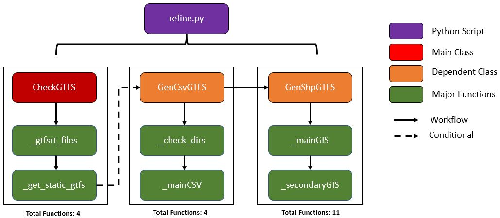

# Extensive Documentation - Data Processing Workflow 

## Structure Overview
The **main_process.py** script contains 2 major processes (i.e., classes) that require the user to input x parameters.
 

<h2>1st Major Process - CheckGTFS</h2>

### A) Purpose
Checks for any updates static GTFS files relative to the date collection of the GTFS-RT. If there is an update, the process will download and create new GTFS routes and transit stops as csv and shapefiles in parallel. Having the appropriate shapefiles up-to-date are critical as it is used to calculate transit metrics downstream. 

### B) Function Details
With a total of 692 lines of code in the <strong>refine.py</strong> script, <strong>CheckGTFS</strong> class depends on two internal classes, which are <strong>GenCsvGTFS</strong> and <strong>GenShpGTFS</strong>. However, these classes are conditional indicating that they will only execute if an update is required. Otherwise, it will skip and proceed to the next workflow process. Parallel run-time varies on the number of cores (and CPU type) available and number of routes that represent the transit network. For Calgary Transit on an 8-core Intel Xeon machine, took about 50 minutes to complete. By comparison on a 96-core machine - 5 minutes to complete.  

### C) Dependencies
**Internal Classes**
<ol>
	<li><strong><i>GenCsvGTFS</i></strong>
		<ul>
			<li>Creates transit routes and stops as CSV files from the updated static GTFS files.</li>
		</ul>
	</li>
	<li><strong><i>GenShpGTFS</i></strong> 
		<ul><li>Creates transit routes (undissolved and undissolved) and stops as shapefiles stored in the <a href='../data/2_staging'>../data/2_staging</a> folder via Route and Stops, respectively.</li></ul>
	</li>
</ol>

**Utils:** discover_docs.py, parallelize.py, process_time.py

### D) Required Parameters
| Parameter | Type | Purpose |
| :-------: | ---- | ------- |
| ***main_link*** | Str | The main string of the main hyperlink (e.g., https://transitfeeds.com).|
| ***pattern_txt*** | Str | The pattern text of the entire hyperlink (not the main hyperlink). |
| ***hyperlink*** | Str | The entire hyperlink (e.g., https://transitfeeds.com/p/calgary-transit/238/latest/download). | 
| ***start_method*** | Str | The start method to initiate parallel processing (Linux set to "spawn" since it uses ArcPy, otherwise "fork"; Windows set to "spawn".) | 
| ***wkid*** | Str | Well-known ID of the spatial reference (e.g., 4326; 3857). |

### E) Step Details

Below are the backend steps (in order) briefly explained followed by a graphic that encapsulates it.
<ol>
	<li>Run <strong>CheckGTFS</strong>
		<ul>
			<li>Get inventory of GTFS-RT csv files that need to be processed (lines 554-578).</li>
			<li>Get the static GTFS files from the transit agency (lines 649-692).</li>
			<li>Create required directories if they don't exist and migrate GTFS-RT to specified date folder (lines 581-631).</li>
			<li>If there are no static GTFS files in specified date folder, download and extract updated version and proceed to GenCsvGTFS and GenShpGTFS class (lines 633-646).
		</ul>
	</li>
	 
	<li>If true, initiate <strong>GenCsvGTFS</strong>
		<ul>
			<li>Create sub-folders (TripIDs, Stops, Routes) in the 2_staging folder if it does not exist (lines 371-382)</li>
			<li>Read selected static GTFS files and create GTFS routes and transit stops as csv files in parallel (lines 477-525).</li>
		</ul>
	</li>
	 
	<li>If true, initiate <strong>GenShpGTFS</strong>
		<ul>
			<li>List csv files (lines 77-98 executed in line 53) and then create undissolved transit routes and transit stops (lines 184-207 executed in lines 56-59) in parallel.</li>
			<ul>
				<li>Restructure dataframe to identify which indices does each transit stop belong to to create undissolved and dissolved transit routes (lines 101-150).</li>
				<li>Create undissolved (i.e., individual line segment) transit route (lines 210-254).</li>
				<li>Create transit stops for each route (lines 257-286).</li>	
			</ul>
			<li>List recently created shapefiles (lines 289-309 executed in line 66) and then create in parallel dissolved transit routes as shapefiles (lines 318-329 executed in line 312-315 via lines 69-72).</li>
		</ul>
	</li>
</ol>
 
 

 
 
	
## F) Packages Used & Purpose
| Package | Purpose |
| :--------: | ------- |
|    re   | To compile regex expressions in a pattern text. |
| shutil  | To move GTFS-RT to its date folder where dated static GTFS files are stored. |
| zipfile | To unzip downloaded static GTFS files. |
| os.path | Create project sub-folders and sub-folder in the 2_staging folder, if they don't exist. |
| multiprocessing | In preparation for the parallel processing, use the cpu_count function to count how many CPUs available on the machine. |
| requests | Get hyperlinks and latest update from the transit feed supplying static GTFS files. |
| bs4 | Parsing html data into readable format via BeautifulSoup. |
| Pandas | Reading tables and csv files, and performing data engineering processes. |
| NumPy | Index searching and splitting list into nested arrays in preparation for parallel procesing. | 
| ArcGIS API for Python | Creating Polyline and Point geometries, converting to spatial dataframes and exporting to shapefiles in parallel. |
| ArcPy | Using the dissolve function in parallel to create dissolved transit routes. |
| time  | Formatting date string to month number. |
| tqdm | Progress bar. |

