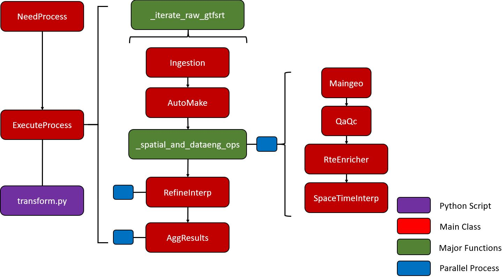

# Extensive Documentation - Data Processing Workflow 

## Structure Overview
The **main_process.py** script contains 2 major processes (i.e., classes) that require the user to input x parameters.
 

<h2>1st Major Process - CheckGTFS</h2>

### A) Purpose
Checks for any updates static GTFS files relative to the date collection of the GTFS-RT. If there is an update, the process will download and create new GTFS routes and transit stops as csv and shapefiles in parallel. Having the appropriate shapefiles up-to-date are critical as it is used to calculate transit metrics downstream. 

### B) Function Details
With a total of 692 lines of code in the <strong>refine.py</strong> script, <strong>CheckGTFS</strong> class depends on two internal classes, which are <strong>GenCsvGTFS</strong> and <strong>GenShpGTFS</strong>. However, these classes are conditional indicating that they will only execute if an update is required. Otherwise, it will skip and proceed to the next workflow process. Parallel run-time varies on the number of cores (and CPU type) available and number of routes that represent the transit network. For Calgary Transit on an 8-core Intel Xeon machine, took about 50 minutes to complete. By comparison on a 96-core machine - 5 minutes to complete.  

### C) Dependencies
**Internal Classes**
<ol>
	<li><strong><i>GenCsvGTFS</i></strong>
		<ul>
			<li>Creates transit routes and stops as CSV files from the updated static GTFS files.</li>
		</ul>
	</li>
	<li><strong><i>GenShpGTFS</i></strong> 
		<ul><li>Creates transit routes (undissolved and undissolved) and stops as shapefiles stored in the <a href='../data/2_staging'>../data/2_staging</a> folder via Route and Stops, respectively.</li></ul>
	</li>
</ol>

**Utils:** discover_docs.py, parallelize.py, process_time.py

### D) Required Parameters
| Parameter | Type | Purpose |
| :-------: | ---- | ------- |
| ***main_link*** | Str | The main string of the main hyperlink (e.g., https://transitfeeds.com).|
| ***pattern_txt*** | Str | The pattern text of the entire hyperlink (not the main hyperlink). |
| ***hyperlink*** | Str | The entire hyperlink (e.g., https://transitfeeds.com/p/calgary-transit/238/latest/download). | 
| ***start_method*** | Str | The start method to initiate parallel processing (Linux set to "spawn" since it uses ArcPy, otherwise "fork"; Windows set to "spawn".) | 
| ***wkid*** | Str | Well-known ID of the spatial reference (e.g., 4326; 3857). |

### E) Step Details

Below are the backend steps (in order) briefly explained followed by a graphic that encapsulates it.
<ol>
	<li>Run <strong>CheckGTFS</strong>
		<ul>
			<li>Get inventory of GTFS-RT csv files that need to be processed (lines 554-578).</li>
			<li>Get the static GTFS files from the transit agency (lines 649-692).</li>
			<li>Create required directories if they don't exist and migrate GTFS-RT to specified date folder (lines 581-631).</li>
			<li>If there are no static GTFS files in specified date folder, download and extract updated version and proceed to GenCsvGTFS and GenShpGTFS class (lines 633-646).
		</ul>
	</li>
	 
	<li>If true, initiate <strong>GenCsvGTFS</strong>
		<ul>
			<li>Create sub-folders (TripIDs, Stops, Routes) in the 2_staging folder if it does not exist (lines 371-382)</li>
			<li>Read selected static GTFS files and create GTFS routes and transit stops as csv files in parallel (lines 477-525).</li>
		</ul>
	</li>
	 
	<li>If true, initiate <strong>GenShpGTFS</strong>
		<ul>
			<li>List csv files (lines 77-98 executed in line 53) and then create undissolved transit routes and transit stops (lines 184-207 executed in lines 56-59) in parallel.</li>
			<ul>
				<li>Restructure dataframe to identify which indices does each transit stop belong to to create undissolved and dissolved transit routes (lines 101-150).</li>
				<li>Create undissolved (i.e., individual line segment) transit route (lines 210-254).</li>
				<li>Create transit stops for each route (lines 257-286).</li>	
			</ul>
			<li>List recently created shapefiles (lines 289-309 executed in line 66) and then create in parallel dissolved transit routes as shapefiles (lines 318-329 executed in line 312-315 via lines 69-72).</li>
		</ul>
	</li>
</ol>
 
 

 
 
	
### F) Packages Used & Purpose
| Package | Purpose |
| :--------: | ------- |
|    re   | To compile regex expressions in a pattern text. |
| shutil  | To move GTFS-RT to its date folder where dated static GTFS files are stored. |
| zipfile | To unzip downloaded static GTFS files. |
| os.path | Create project sub-folders and sub-folder in the 2_staging folder, if they don't exist. |
| multiprocessing | In preparation for the parallel processing, use the cpu_count function to count how many CPUs available on the machine. |
| requests | Get hyperlinks and latest update from the transit feed supplying static GTFS files. |
| bs4 | Parsing html data into readable format via BeautifulSoup. |
| Pandas | Reading tables and csv files, and performing data engineering processes. |
| NumPy | Index searching and splitting list into nested arrays in preparation for parallel procesing. | 
| ArcGIS API for Python | Creating Polyline and Point geometries, converting to spatial dataframes and exporting to shapefiles in parallel. |
| ArcPy | Using the dissolve function in parallel to create dissolved transit routes. |
| time  | Formatting date string to month number. |
| tqdm | Progress bar. |

<h2>2nd Major Process - NeedProcess</h2>

	
### A) Purpose
Identifies which raw GTFS-RT csv file needs to be processed based on it not being labelled "complete." Additionally, it will be used to identify which static GTFS files need to be read. 

### B) Required Parameters
Only one parameter, ***main_folder***, is required. The ***main_folder*** is the directory (relative or absolute) path pointing to the folder where the raw near real-time GTFS csv file is hosted (before moving it to its GTFS static folder) and the GTFS static folder (formatted as date) containing static files (e.g., stops, routes, scheduled times). Assuming the folder directory structure remains the same, the parameter input would be: ***"../data/0_external/GTFS"***. 

### C) Packages Used & Purpose
	
| Package | Purpose |
| :----: | :----: | 
| discover_docs | Custom Python script to scan csv files and indicate whether it has been processed (i.e., complete) prior or not. | 

<h2>3rd Major Process - ExecuteProcess</h2>

	
### A) Purpose
This is the main GTFS workflow process that converts collected near real-time GTFS data into aggregated on-time performance metrics. The general workflow process are structured in the following ordered downstream: 

<ol>
<li>Create folder structure based on the GTFS-RT date within the GTFS main folder, if it does not exist.</li>
<li>Within the <strong>_spatial_and_dataeng_ops</strong> function that is run in parallel:</li>
<ul>
	<li>Perform spatial operations - identify precisely all vehicle locations collected over time.</li>
	<li>Perform Qa/Qc of the data - remove any unnecessary / junk data.</li>
	<li>Enrich the dataset with additional attributes.</li>
	<li>Perform Interpolation</li>
</ul>
<li>Run in parallel: refine & clean up any junk / unnecessary data in the interpolated files that has not been flagged earlier.</li>
<li>Run in parallel: the data aggregation process.</li>
</ol>
	
### B) Function Details
With a total of 478 lines of code in the ***transform.py*** script, ExecuteProcess class depends on 9 internal classes, which are: Ingestion, Maingeo, QaQc, RteEnricher, SpaceTimeInterp, AutoMake, ParallelPool, RefineInterp, and AggResults. Parallel run-time varies on the number of cores (and CPU type) available and number of routes that represent the transit network. For Calgary Transit on an 8-core Intel Xeon machine, took between 4 - 6 hours to complete. By comparison on a 96-core machine - 14.5 minutes to complete.

### C) Dependencies
**Internal Classes**
<ol>
	<li><strong><i>Ingestion</i></strong>
		<ul>
			<li>Identify which static GTFS files need to be read based on the same directory wherre the raw GTFS-RT csv file is located. Read GTFS-RT file that needs to be processed and appropriate static GTFS files. Create dataframe that matches each trip_id to the dissolved & undissolved routes and transit stops shapefiles.</li>
		</ul>
	</li>
	 
	<li><strong><i>AutoMake</i></strong> 
		<ul><li>Automatically creates sub-folders (e.g., "../data/2_staging/{folder_date}/{raw_date}")</li></ul>
	</li>
	 
	<li><strong><i>ParallelPool</i></strong>
		<ul>
			<li>Instantiating parallel processing via the Pool method.</li>
		</ul>
	</li>
	 
	<li><strong><i>Maingeo</i></li></strong>
		<ul><li>From the geoapi.py, it identifies the locations (i.e., snapping points) of the vehicles along the transit route.</li>
		</ul>
	</li>
	 
	<li><strong><i>QaQc</i></li></strong>
		<ul><li>From the qaqc.py, removes "hazardous" observations (if applicable) that can tarnish calculations of transit metrics downstream. Outputs cleaner dataframe (in memory & in storage through 3_interim folder) and reports how much data has been retained after cleaning.</li>
		</ul>
	</li>
	 
	<li><strong><i>RteEnricher</i></strong>
		<ul><li>Enriches the cleaner version of the individual transit route with additional attributes - mainly estimate vehicle movement type (stationary, movement, terminus) and set check points (validates quality of static GTFS via maximum stop sequence.).</li></ul>
	</li>
	 
	<li><strong><i>SpaceTimeInterp</i></strong>
	<ul><li>From the interpolate.py, performs spatio-temporal interpolation between consecutive pair (1st and 2nd recording at a time). Estimates projected travel speed & travel time to arrive stop_id destination, determines if it is on-time, late, or early.</li></ul>
	</li>
	 
	<li><strong><i>RefineInterp</i></strong>
	<ul><li>From the prep_agg_parallel.py, cleans out unwanted observations in all interpolated files in parallel prior to aggregation processing. Specifically, it investigates at beginning and terminus stops (typically found in loop routes) that may be geographically incorrect.</li></ul>
	</li>
	 
	<li><strong><i>AggResults</i></strong>
	<ul><li>From the aggregation.py, finalizes the interpolated (cleaned version) results and aggregates. More details on the aggregation can be found in section E.</li></ul>
	</li>
</ol>

### D) Required Parameters
| Parameter | Type | Purpose |
| :-------: | ---- | ------- |
| ***csv_inf*** | DataFrame | DataFrame that contains information of each raw GTFS-RT csv file to be processed.|
| ***start_method*** | Str | The start method to initiate parallel processing (Linux set to "spawn" since it uses ArcPy, otherwise "fork"; Windows set to "spawn".) | 
| ***wkid*** | Str | Well-known ID of the spatial reference (e.g., 4326; 3857). |

### E) Step Details
Below is a figure that encapsulates the backend processing steps to converting raw GTFS-RT csv files to data aggregation. 
 
 

