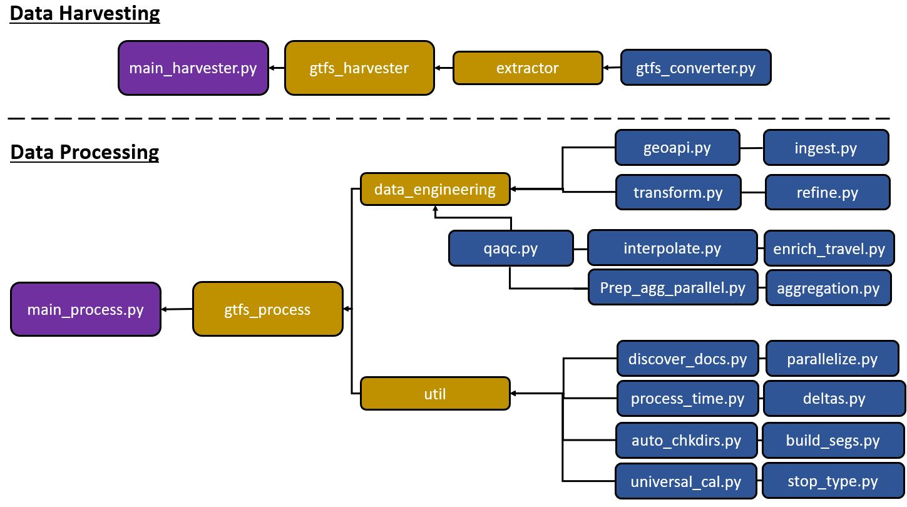

# Overview of the Workflow
An overview of the workflow that can be downloaded as a Python package. For organizational purposes, documentation is divided into three components. These are: **1) Data Harvesting**, **2) Data Workflow (main)**, and **3) Data Storage** and they're written in detailed in separate files. The workflow is designed to be downstream, starting from data harvesting and ending at data storage. 
 
 

## Data Harvesting 
Collects GTFS-RT every nth (e.g., 30) seconds for x (e.g., 14) hours per day, parses it, and appends to csv file. The csv file is named after the date of collection (e.g., GTFSRT_2022-01-15.csv). Use [**main_harvester.py**](main_harvester.py) to input parameters. The general workflow of this component are in the following steps: 
1) Request feed from the hyperlink containing GTFS-RT .pb file. 
2) Extract entities from the feed.
3) Convert the extracted entities into a Pandas DataFrame. 
4) Append dataframe to csv. 
5) Iterate steps 1-4 until defined iteration (i.e., # of hours) is complete. 

Extensive documentation including backend code can be viewed in the [**gtfs_harvester**](gtfs_harvester) folder.

## Data Processing
The main operation of the workflow that processes collected raw GTFS-RT data and outputs transit metrics. Approximately 95% of this component runs in parallel. Extensive documentation including backend code can be viewed in the [**gtfs_process**](gtfs_process) folder.

## Data Storage
Sends the output transit metrics to MongoDB for storage. Extensive documentation including backend code can be viewed in the [**gtfs_storage**](gtfs_storage) folder.
