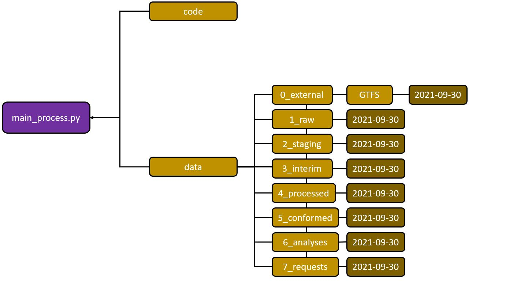

# How the Folder Directory Structure Works

The developer / user must retain a relative directory structure as shown in the figure below: 

Within the folders are sub-folders created basd on the GTFS static update and the date of the near real-time GTFS. 

<ol> 
  <li><strong>0_external</strong>: Where the near real-time and static GTFS files are stored. </li> 
   
  <li><strong>1_raw</strong>: Empty folder - nothing is stored in this.</li>  
   
  <li><strong>2_staging</strong>: Where individual routes, stops, and trip_ids are stored per GTFS static update as csv and shapefiles. </li> 
   
  <li><strong>3_interim</strong>: Per GTFS static update per near real-time GTFS date are a csv file per route that contains snapped locations of the vehicles (*_located.csv) and cleaner version of it (*_cleaned.csv).</li> 
   
  <li><strong>4_processed</strong>: Per GTFS static update per near real-time GTFS date are a csv file per route that supplements the spatio-temporal locations of the vehicles.</li>
   
  <li><strong>5_conformed</strong>: Per GTFS static update per near real-time GTFS date are a csv file per route containing interpolated results (original & cleaned version). </li>
   
  <li><strong>6_analyses</strong>: Per GTFS static update per near real-time GTFS date are a geojson file containing general aggregated results. The aggregated results are structured per route per trip_id per stop.</li>
   
  <li><strong>7_requests</strong>: Per GTFS static update per near real-time GTFS date are two geojson files containing daily and hourly aggregated results.</li>
 </ol>
